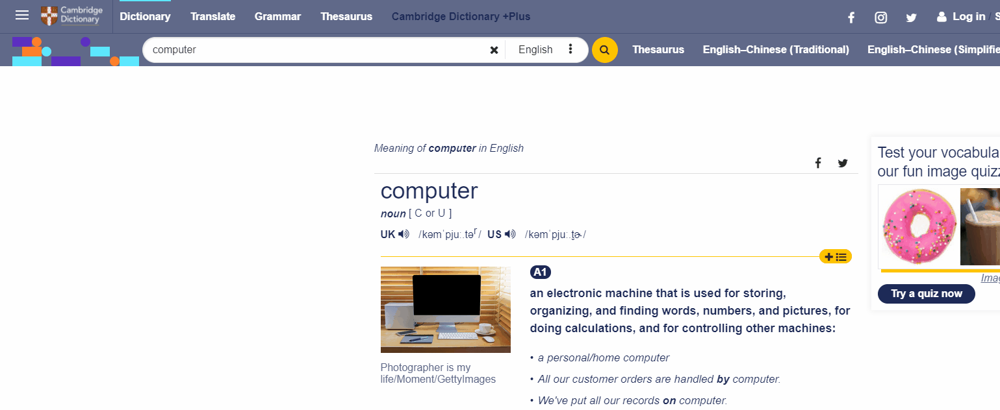

# transparent-nav.js

## What is this?
A tampermonkey user script which generates webpages' navigation bar to acrylic-material.

## How to use?
1. To use user scripts, you will need a browser extension that executes GreasyFork scripts. These are the common extensions for different browsers:
	* Chrome - [Tampermonkey](https://tampermonkey.net/?ext=dhdg&browser=chrome).
    * Firefox - [Tampermonkey](https://tampermonkey.net/?ext=dhdg&browser=firefox) or [Greasemonkey](https://addons.mozilla.org/en-US/firefox/addon/greasemonkey/).
	* Opera - [Tampermonkey](https://tampermonkey.net/?ext=dhdg&browser=opera) or [Violent Monkey](https://addons.opera.com/en/extensions/details/violent-monkey/).
	* Safari - [Tampermonkey](https://tampermonkey.net/?ext=dhdg&browser=safari).
2. Once you installed the extension, you can click [here](https://greasyfork.org/en/scripts/425364-transparent-navigation-bar) to install this user script. Make sure you enable the script so that the script can run on different websites.
3. Encounters problems? Don't hesitate to ask on the [discussion page](https://github.com/ShingZhanho/transparent-nav.js/discussions)!

## Showcase
<table>
	<tr>
		<td><td>
		<td><td>
	</tr>
<table>

## Compatibility
The transparent effects rely on the `backdrop-filter` property of css. Thus, your browser need to support that property. Please note that Firefox does not support `backdrop-filter` by default, you may need to enable that option manually.

## Supported Websites
Here are the supported websites of this script:
 
<table>
<tr><th>Website Name</th><th>URL</th><th>Remarks</th></tr>

<tr><td>Cambridge Dictionary</td><td><code>dictionary.cambridge.org</code></td><td></td></tr>

<tr><td>Google Classroom</td><td><code>classroom.google.com</code></td><td></td></tr>

<tr><td>Google Search</td><td><code>www.google.*/search</code></td><td>This applies to all area's Google search, i.e. <code>www.google.co.uk</code>, <code>www.google.com.hk</code> etc.</td></tr>

<tr><td>UK Royal Family Website</td><td><code>www.royal.uk</code></td><td></td></tr>

<tr><td>W3Schools</td><td><code>www.w3schools.com</code></td><td></td></tr>
</table>